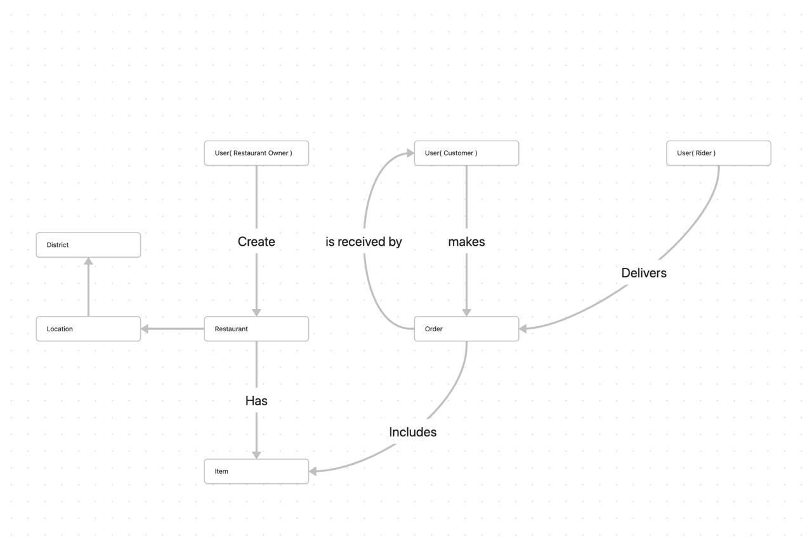

# Restaurant Management API (Learning Project)

This is a Node.js Express API built as a learning project to understand how to create a backend system for a restaurant management application. The API includes features like authentication, restaurant management, item management, and order management. It uses Prisma as the ORM and PostgreSQL as the database.

## Obsidian Map

